# FieldNote

**A configurable AI chief-of-staff for market and competitor intelligence.**

Describe any market, industry, set of companies, technology or topic in plain language ("quick-commerce
grocery delivery in India: Blinkit, Zepto, Swiggy Instamart") and FieldNote drafts a workspace (entities,
aliases, customer-voice aspects, news searches, candidate sources), verifies every source before you save
it, and then will:

1. **Collect** public information: news feeds, competitor web pages, public customer discussions
   (Reddit, YouTube) and optional market metrics you supply.
2. **Detect what changed** since the last run (prices, launches, policies, dealer networks, features).
3. **Research, verify and analyse** with a four-agent pipeline (researcher, critic, analyst, writer) that
   turns evidence into sourced, decision-ready findings.
4. **Rank findings deterministically** with configurable weights, never by model opinion.
5. **Answer questions** ("Ask FieldNote") from its local database, with citations.
6. **Track action items** extracted from pasted meeting notes, with reminders.
7. **Deliver** a one-page daily brief and a weekly PDF decision memo by Telegram or email, and show
   everything in a web dashboard.

Every statement FieldNote outputs is a claim with a source and a verbatim excerpt, checked by a critic
before anyone sees it. Estimates are labelled, low-sample comparisons are flagged, and when the evidence
is not there, FieldNote says what is missing.

---

## Quickstart

Needs Python 3.11+. One free LLM key (Gemini, NVIDIA or Groq) is enough to start.

```bash
git clone <this repo> fieldnote && cd fieldnote
python -m venv .venv
.venv/bin/pip install -e .            # Windows: .venv\Scripts\pip install -e .
cp .env.example .env                  # add your keys (see the table below)
fieldnote doctor                      # checks configs, keys, every source URL and robots.txt
fieldnote dashboard                   # http://localhost:8501
```

The dashboard starts collecting real data immediately: every workspace gets a first full analysis, then
source checks every 30 minutes. With `make`: `make install` then `make dashboard`.

**Just want to look around first?** `fieldnote demo` runs the whole pipeline on bundled fixture data
(fictional brands, `.example` links, no keys, no network) and `fieldnote dashboard --demo` shows it, labelled
as demo data on every page. It writes the brief, the weekly PDF memo, a dry-run outbox and the eval report
under `out/`, and `data/demo.db`.

**Live data.** The dashboard shows live data only (the fixture dataset appears only with
`fieldnote dashboard --demo`, labelled on every page). While it runs, a scheduler keeps every active
workspace current:

| Job | Default | What it does |
|---|---|---|
| Source check (`fieldnote pulse`) | every 30 min | News searches and feeds, watched competitor pages (diffed for changes), Reddit and YouTube when keys are set; new items are tagged. Few or no LLM calls. |
| Full analysis (`fieldnote run`) | every 6 h | Researcher, critic, analyst and writer over everything collected; replaces the findings and the brief. A new workspace gets one immediately. |
| Daily delivery | after 07:00 local | The next analysis sends the brief through the workspace's channels (only when Telegram/SMTP are configured). |
| Housekeeping | daily | Action reminders, retention, and the weekly memo on Mondays. |

Intervals are set with `FIELDNOTE_PULSE_MINUTES`, `FIELDNOTE_ANALYSIS_HOURS` and
`FIELDNOTE_DELIVER_AT_HOUR`. Pages update themselves as new data lands (Server-Sent Events): the header shows
when sources were last checked and when the next check is due, and the Overview's live feed shows the
newest items. `Check sources now` and `Run full analysis` on the Workspaces page start a run immediately.
In production, run the web app with `FIELDNOTE_SCHEDULER=off` and one `fieldnote live` worker (the
docker-compose file does this); a workspace never runs twice at once, even across processes.

### Keys

Everything is optional except one LLM key. Reddit needs an approved "script" app
(reddit.com/prefs/apps, plus Reddit's API access request); YouTube needs a Data API v3 key from
console.cloud.google.com. Google News RSS is skipped because its robots.txt disallows crawlers.

| Credential | Enables | Without it |
|---|---|---|
| `GEMINI_API_KEY` | **Free** Google Gemini tier (key from aistudio.google.com/apikey; `GEMINI_MODELS`, `GEMINI_FAST_MODELS`, `GEMINI_RPM`) | Next provider / MockClient |
| `NVIDIA_API_KEY` | **Free** NVIDIA NIM tier (key from build.nvidia.com; `NVIDIA_MODELS`, `NVIDIA_FAST_MODELS`, `NVIDIA_RPM`) | Next provider / MockClient |
| `GROQ_API_KEY` | **Free** Groq tier (key from console.groq.com/keys; `GROQ_MODELS`, `GROQ_FAST_MODELS`, `GROQ_RPM`) | Next provider / MockClient |
| `ANTHROPIC_API_KEY` | Paid Claude API (`FIELDNOTE_MODEL`, `FIELDNOTE_FAST_MODEL`) | Next provider / MockClient |
| `REDDIT_CLIENT_ID` / `_SECRET` / `_USER_AGENT` | Reddit via the official API | Reddit skipped |
| `YOUTUBE_API_KEY` | YouTube comments via Data API v3 | YouTube skipped |
| `TELEGRAM_BOT_TOKEN` / `TELEGRAM_CHAT_ID` | Telegram delivery | Dry-run outbox |
| `SMTP_*` | Email delivery with attachments | Dry-run outbox |
| `GOOGLE_SERVICE_ACCOUNT_JSON` / `GOOGLE_SHEETS_SPREADSHEET_ID` | Action tracker sync to Google Sheets | CSV export only |
| `DATABASE_URL` | Postgres (or any SQLAlchemy URL); also shares workspaces between a hosted dashboard and the scheduler | SQLite in `data/` |
| `FIELDNOTE_DASHBOARD_PASSWORD` | Password gate for a hosted dashboard | Open dashboard (fine locally) |
| `FIELDNOTE_DASHBOARD_READONLY=1` | Hides create/edit/run/archive controls | Controls shown |

Any one LLM key is enough. With several, `FIELDNOTE_LLM=auto` chains them (Anthropic, then Gemini, then
NVIDIA, then Groq), and within each provider the models run best first. Defaults (chosen from live
structured-output tests; override with the `*_MODELS` lists):

| Provider | Main models, in order | Fast models |
|---|---|---|
| Gemini | gemini-3.8-flash, gemini-3.7-flash, gemini-3.5-flash, gemini-2.5-flash | gemini-3.5-flash-lite, gemini-3.1-flash-lite |
| NVIDIA | nemotron-3-ultra-550b, nemotron-3-super-120b | nemotron-3-super-120b |
| Groq | gpt-oss-120b, gpt-oss-20b | gpt-oss-20b |

When a model is out of quota (a daily free-tier limit), overloaded or failing, the same call goes to the
next model and the failed one is skipped for a while (an hour for a spent daily quota, 10 minutes for an
outage), so later calls do not wait on it. Set an explicit provider order with e.g.
`FIELDNOTE_LLM=gemini,nvidia,groq`. Free tiers are rate limited, so calls are spaced
to `*_RPM` requests per minute and 429s are retried with backoff; a full run takes longer than on a paid
key (a run makes roughly 50-150 model calls per workspace). Free-tier calls are recorded at $0, so the
run budget does not limit them. `fieldnote doctor --check-llm` verifies your keys and model names.

Delivery happens only when a channel is listed in the workspace's `delivery.channels` **and** its
credentials are set. News feeds and competitor pages need no keys.

## Architecture

```mermaid
flowchart LR
    A[Collectors<br/>news · pages · Reddit · YouTube · connectors] --> B[(Documents<br/>snapshots · metrics)]
    B --> C[Processing<br/>dedupe · change detection · tagging · themes · claim vs reported · metrics]
    C --> D[Researcher<br/>read-only tool loop]
    D --> E[Critic<br/>deterministic checks + LLM entailment]
    E --> F[Analyst]
    F --> G[Critic<br/>overreach + counter-evidence]
    G --> H[Deterministic scoring]
    H --> I[Writer<br/>prose only + post-check]
    I --> J[Daily brief · Weekly PDF · Ask · Dashboard]
    J --> K[Telegram · Email · Dry run]
```



More detail, including the trust sequence and data model: [docs/architecture.md](docs/architecture.md).

## The two example workspaces

| | `ev_two_wheelers_india` (deep demo) | `budget_smartphones_india` (reusability) |
|---|---|---|
| Sector | Electric two-wheelers, India | Budget smartphones (under ₹15,000), India |
| Viewpoint | `focal_company: null`, perspective "new-entrant challenger brand" | market-level, "value-focused smartphone brand" |
| Competitors | 8 market players with verified product pages | 8 market players with verified product pages |
| Aspects | range, price, service, software, build quality, delivery, charging, battery | battery life, camera, performance, display, software updates, price, service |
| Claim vs reported | range in km (min n = 10) | battery life in hours (min n = 8) |
| Sources | GDELT news search, 3 verified RSS feeds, subreddits, YouTube searches | GDELT news search, 5 verified RSS feeds, subreddits, YouTube searches |

The second workspace runs with **only a config change**: there is no sector-specific logic in code.
Offline, both use fictional brands from `fixtures/<workspace>/manifest.json`.

## Create a workspace for any topic

**From the library.** The dashboard's **Workspaces → New workspace** tab (also reachable from the last
entry of the sidebar's workspace selector) opens a library of 44 topics in 10 categories: commerce,
mobility and travel, consumer tech, finance, software and AI, food and drink, health, media, energy and
home, education. Pick a region (India, United States, United Kingdom, Global, or type any other), then
*Use this*. Each topic lists well-known players for the region; the model can add more.

**In your own words.** Describe what to track, review the draft and press *Create workspace*; the first
live collection can start right away. From the terminal:

```bash
fieldnote workspace templates --category Finance --region "United Kingdom"
fieldnote workspace new --template stock_trading_apps --region "United Kingdom"
fieldnote workspace new "UK challenger banks such as Monzo, Starling and Revolut"
fieldnote run -w uk_challenger_banks --dry-run
```

The sidebar selector lists the workspaces you have created. Each one collects and analyses daily, so the
library holds the rest until you add them, which keeps runs within free LLM quotas.

What happens:

1. **Draft.** The LLM proposes the main players (with aliases), 4-8 customer-voice aspects with signal
   words, headline-style news searches, and candidate feeds, publication sites, official pages and
   subreddits. Without an LLM key (or if the call fails) a rule-based drafter reads the names from your
   description and never proposes URLs.
2. **Verify.** Every URL is fetched politely (robots.txt, rate limits, private-address guard). Feeds must
   parse with recent items; sites are searched for their RSS/Atom feed; pages must return readable text;
   the news search is probed once (and widened to worldwide sources if the country has no hits);
   subreddits are checked through the Reddit API when keys exist. Anything that fails is dropped and
   listed at the end of the YAML with the reason.
3. **Review and save.** Edit names, aliases, aspects, search phrases and which verified sources to keep.
   The result is validated by the same strict schema as hand-written files, written to
   `workspaces/<id>.yaml` **and** stored in the database, so a workspace created on a hosted dashboard is
   picked up by the scheduler through the shared `DATABASE_URL`.

Manage workspaces with `fieldnote workspace list|show|import|archive|restore` or the dashboard's
*This workspace* (run now, live progress, edit YAML, download) and *All workspaces* (import, archive,
restore) tabs. Archiving hides a workspace from lists and scheduled runs and keeps its data.

To write a workspace by hand instead:

```bash
fieldnote init -w my_market     # copies workspaces/_template.yaml (fully commented)
fieldnote doctor -w my_market   # validates it and checks every URL
fieldnote run -w my_market --dry-run
```

Step-by-step: [docs/adding-a-workspace.md](docs/adding-a-workspace.md).

## Capabilities

| Capability | Implemented in |
|---|---|
| Workspace config with validation and helpful errors | `config.py`, `workspaces/*.yaml` |
| Workspace builder: plain-language topic -> drafted, source-verified, validated workspace | `builder/core.py`, `builder/verify.py`, `builder/heuristic.py` |
| Workspace library: 44 topics x regions with example players | `builder/catalog.py` |
| Workspace registry (files + database copies, archive/restore, import) | `workspaces.py` |
| Polite HTTP (robots.txt, honest UA, per-host rate limit, ETag/Last-Modified, backoff, private-address guard) | `collectors/base.py` |
| News: GDELT topic search (open, no key), RSS/Atom, region-aware Google News RSS; full text via trafilatura | `collectors/rss_news.py`, `collectors/gdelt.py` |
| Competitor pages, price/heading hints, optional Playwright rendering | `collectors/pages.py`, `processing/clean.py` |
| Reddit (PRAW) and YouTube (Data API v3, quota-aware), no author data | `collectors/reddit.py`, `collectors/youtube.py` |
| Pluggable metrics connectors (`csv_file`, `http_json`, registry) | `collectors/connectors/*` |
| Offline fixture replay (two rounds) | `collectors/fixtures.py`, `fixtures/` |
| Cleaning, hidden-text removal, dedupe (hash, canonical URL, fuzzy title) | `processing/clean.py`, `processing/dedupe.py` |
| Page change detection (difflib, noise suppression, rules then fast model, significance) | `processing/change_detection.py` |
| Entity tagging and customer-voice tagging (English + Hinglish) | `processing/tagging.py`, `heuristics.py` |
| Themes (TF-IDF + KMeans, silhouette k, labels, week-over-week, emerging) | `processing/themes.py` |
| Claim vs reported (median, IQR, n, low-confidence flags) | `processing/claim_vs_reported.py` |
| Metrics (MoM, shares, movers; arithmetic in code) | `processing/metrics.py` |
| LLM abstraction, forced tool use, validation retries, cache, cost budget | `llm/base.py`, `llm/anthropic_client.py`, `llm/cache.py`, `costs.py` |
| Free tiers (Gemini, NVIDIA, Groq): best-first model chain, quota detection, cool-down circuit breaker | `llm/openai_compat.py` |
| Deterministic MockClient for tests and offline demo | `llm/mock_client.py`, `llm/mock_agents.py` |
| Read-only agent tools (BM25 + recency search, changes, metrics, themes, findings) | `agents/tools.py` |
| Researcher, Critic (2 stages + counter-evidence), Analyst, Writer | `agents/researcher.py`, `agents/critic.py`, `agents/analyst.py`, `agents/writer.py` |
| Explicit state-machine orchestrator with full tracing | `agents/orchestrator.py`, `agents/trace.py` |
| Deterministic Opportunity Board scoring and live re-ranking | `scoring/opportunities.py`, `dashboard/pages/board.py` |
| Ask FieldNote (router, local retrieval, critic-gated citations, session memory) | `ask/router.py`, `ask/answer.py` |
| Meeting notes to action items, date resolution, merge-not-duplicate | `coordination/extractor.py` |
| Tracker, CSV/Sheets export, reminders (once per day, never auto-complete) | `coordination/tracker.py`, `coordination/sheets_export.py`, `coordination/reminders.py` |
| Daily brief (MD/HTML/Telegram), weekly PDF memo with charts | `reports/*` |
| Telegram, SMTP and dry-run delivery | `delivery/*` |
| Evals and README table | `evals/*` |
| Full pipeline, idempotent runs, retention | `pipeline.py`, `db/repo.py` |
| CLI, doctor, export | `cli.py`, `doctor.py`, `exporter.py` |
| Live scheduler: source checks, periodic analysis, daily delivery, housekeeping | `live/scheduler.py`, `dashboard/runner.py` |
| Web dashboard (React + TypeScript): 10 insight pages + Workspaces, live updates over Server-Sent Events, optional password | `web/`, `web/server.py`, `web/live_api.py` |

## CLI

`fieldnote init` · `doctor` · `workspace templates|new "..."|new --template ID|list|show|import|archive|restore` ·
`collect` · `process` · `pulse` · `live` ·
`run [--workspace X] [--dry-run] [--offline] [--weekly] [--all-workspaces]` · `ask "..."` · `notes add FILE|-` ·
`actions list|done|drop|update|export` · `remind [--all-workspaces]` · `brief daily|weekly [--all-workspaces]` ·
`eval [--all] [--live-llm] [--update-readme]` · `dashboard [--demo] [--no-scheduler]` · `demo` · `export` · `purge [--all-workspaces]`.
`--all-workspaces` covers every active workspace, from files and from the database.
Exit codes: 0 success, 2 partial (some stages degraded), 1 failure.

## Design decisions (short version)

* **Critic-gated claims.** Facts carry a source id and a verbatim excerpt; estimates carry a method and a
  derivation that the critic recomputes; analysis lists its dependencies. Rejected or unjudged claims
  never reach an output.
* **Deterministic scoring.** Evidence strength is computed; the rest are 1-5 ratings with rationales.
  Same inputs give the same ranking; sliders re-rank without LLM calls.
* **Read-only tools and delimited data.** Agents cannot write, send or run SQL. Collected text is wrapped
  as untrusted data; delivery is triggered only by the CLI/scheduler. The writer never sees raw documents.
* **Provider abstraction.** `LLMClient` with `AnthropicClient`, `OpenAICompatClient` (free Gemini and
  NVIDIA tiers), a `FallbackClient` chain and a deterministic `MockClient`; every call is cached and budgeted.

Full rationale: [docs/design-decisions.md](docs/design-decisions.md).

## Evals

`fieldnote eval` writes `out/eval_report.md` and stores results for the dashboard's Evals page. The table
below is generated from a real run (`fieldnote demo --update-readme`) on the fixture data.

<!-- EVAL_TABLE_START -->
_Auto-generated by `fieldnote eval --update-readme` on 2026-09-24 (mock LLM path)._

| Workspace | Eval | Result | Target | Status |
|---|---|---|---|---|
| ev_two_wheelers_india | Citation validity | 100.0% (37/37) | >= 95% | PASS |
| ev_two_wheelers_india | Critic adversarial catch rate (mock) | 96.5% (111/115) | >= 90% | PASS |
| ev_two_wheelers_india | Output number/entity consistency | 100.0% of 186 numbers; 100.0% of 17 names | >= 99% | PASS |
| ev_two_wheelers_india | Ranking determinism / weight sensitivity | yes / yes (13 findings) | yes / yes | PASS |
| ev_two_wheelers_india | Run cost / duration | $0.00 / 1.61s (mock) | <= $3.00 | - |
| ev_two_wheelers_india | Action-item extraction (12 notes, 40 items) | P 100.0% / R 100.0%; owner 100.0%, due date 100.0% | P,R >= 80% | PASS |
| budget_smartphones_india | Citation validity | 100.0% (38/38) | >= 95% | PASS |
| budget_smartphones_india | Critic adversarial catch rate (mock) | 96.0% (119/124) | >= 90% | PASS |
| budget_smartphones_india | Output number/entity consistency | 100.0% of 194 numbers; 100.0% of 17 names | >= 99% | PASS |
| budget_smartphones_india | Ranking determinism / weight sensitivity | yes / yes (11 findings) | yes / yes | PASS |
| budget_smartphones_india | Run cost / duration | $0.00 / 1.14s (mock) | <= $3.00 | - |
| budget_smartphones_india | Action-item extraction (12 notes, 40 items) | P 100.0% / R 100.0%; owner 100.0%, due date 100.0% | P,R >= 80% | PASS |
<!-- EVAL_TABLE_END -->

What is measured:

1. **Citation validity**: share of claims whose sources exist and whose excerpt is found in them.
2. **Critic adversarial catch rate**: verified claims are corrupted programmatically (change a number, swap
   an entity, fabricate a fact, flip a direction word) and the critic must reject them. The mock path is
   reported here; run `fieldnote eval --live-llm` with a key to add the live-model rate.
3. **Output number/entity consistency**: every number and competitor name in the brief and memo's finding
   sections traces to that finding's verified claims (system sections trace to computed data).
4. **Action-item extraction**: precision/recall on 12 hand-labeled meeting notes, with owner and due-date
   accuracy reported separately.
5. **Ranking determinism and weight sensitivity.**
6. **Cost and latency per run**, by agent.

## Tests and quality

* `make test` (pytest), `make lint` (ruff), `make typecheck` (mypy), `make cov`.
* 276 tests (Python 3.11 and 3.12): config validation, secret redaction, dedupe, change detection and noise suppression, metric math, scoring and
  tie-breaks, critic stages 1 and 2, claim schemas, date resolution, reminders, delivery dry-run and
  Telegram escaping, prompt-injection fixtures, retention, collectors against fake APIs (robots.txt,
  rate limits, ETags, no author data), the Anthropic client's retry/fallback logic with a fake SDK, the Gemini/NVIDIA client (message translation,
  forced function calls, JSON fallback, 429 backoff, provider fallback) against a fake HTTP session, and an
  end-to-end offline run that asserts briefs, the PDF, database rows, idempotent reruns and the eval
  thresholds.
* Also: the workspace builder (rule-based and model drafts, verification against a fake web with dead,
  robots-blocked, stale and JavaScript-only sources, review edits), the workspace registry (file vs database
  precedence, archive/restore, read-only disks), GDELT search and relevance filtering, the private-address
  guard (including redirects), the best-first model chain and its cool-downs, every library template for
  every region, the live scheduler (pulse runs, schedule clock, run selection) and the live-only dashboard
  context.
* Coverage: **88% overall**; scoring 100%, reminders 100%, builder 82–99%, workspace registry 91%,
  extractor 93%, change detection 91%, critic 86%, collectors 66–97%.

## Deployment

**Dashboard.** Any host that runs a container or a Python process works:

* *Docker*: `docker compose up --build` starts the dashboard on :8501 and a `worker` container
  (`fieldnote live`) that keeps every workspace current: source checks, analysis, the daily brief,
  reminders, retention and the Monday memo.
* *Render / Fly.io*: deploy the `Dockerfile` as a web service on port 8501; set `DATABASE_URL` to a managed
  Postgres so data survives restarts, and add your keys as secrets.
* *Plain Python host*: `pip install .` then `fieldnote dashboard --host 0.0.0.0 --port 8501`; the built UI ships
  inside the package (`src/fieldnote/web/static`), so the host needs no Node. The scheduler runs inside the
  same process unless `FIELDNOTE_SCHEDULER=off`.

**Dashboard UI.** The dashboard is a React + TypeScript app in `web/` served by a small Starlette JSON API
(`src/fieldnote/web/server.py`) over the same database the CLI uses. To change the UI: `make web` rebuilds it
(Node 20+), or run `fieldnote dashboard --port 8502` and `make web-dev` for hot reload on :5173. The old
Streamlit dashboard is still available with `fieldnote dashboard --legacy` while it is phased out.

A hosted dashboard can create workspaces, edit them and start runs, so set `FIELDNOTE_DASHBOARD_PASSWORD`
(or `FIELDNOTE_DASHBOARD_READONLY=1` for a view-only deployment). Use a shared `DATABASE_URL` (managed
Postgres): workspaces created in the dashboard are stored there, and the scheduler's `--all-workspaces`
runs pick them up even when the container's `workspaces/` folder is read-only or ephemeral. To make one
permanent in the repository, download its YAML (*This workspace* tab) or run
`fieldnote workspace show <id> > workspaces/<id>.yaml` and commit it.

**Without a long-running server.** The live scheduler needs a process that stays up. If you can only run
jobs on a timer, use one of these instead (data then refreshes once a day, not every 30 minutes):

* *GitHub Actions*: `.github/workflows/daily.yml` (07:00 IST) runs every workspace, reminders and retention;
  `weekly.yml` renders and delivers the memo on Mondays. Add secrets for the keys you have (for free LLM
  access: `GEMINI_API_KEY` and/or `NVIDIA_API_KEY`; optionally a `FIELDNOTE_LLM` variable). Without
  `DATABASE_URL` the SQLite file is carried between runs via the Actions cache and uploaded as an artifact.
* *cron*: `30 1 * * * cd /srv/fieldnote && .venv/bin/fieldnote run --all-workspaces && .venv/bin/fieldnote remind --all-workspaces`

## Limitations

Public data only; customer voice is a sampled, non-representative slice; market and registration data
depend on what you supply through connectors; LLM extraction can be wrong; estimates are labelled and
low-sample comparisons flagged; FieldNote is not a substitute for human judgement. Details:
[docs/limitations.md](docs/limitations.md).

## Compliance summary

robots.txt is checked before every page and feed; requests carry an honest User-Agent with a contact and
are rate-limited per host; conditional requests avoid refetching; no logins, paywall circumvention or
CAPTCHA handling; Reddit and YouTube only through official APIs; author usernames are never stored;
outputs quote at most ~25 words per source and always link out; registration and sales aggregates are
used only when you obtain them through sanctioned means. Details:
[docs/sources-and-compliance.md](docs/sources-and-compliance.md). Defaults and verified/dropped URLs:
[docs/assumptions.md](docs/assumptions.md).

## Screenshots and demo GIF

_Placeholders: add your own captures here._

| Page | File |
|---|---|
| Overview | `docs/img/overview.png` |
| Opportunity Board with weight sliders | `docs/img/board.png` |
| Customer voice (themes, heatmap, claimed vs reported) | `docs/img/voice.png` |
| Weekly PDF memo | `docs/img/memo.png` |
| Demo GIF (Ask FieldNote) | `docs/img/demo.gif` |

To capture them: run `fieldnote dashboard` on live data (or `--demo` for fixtures); take screenshots at a
1440x900 window in both light and dark themes (sidebar, Theme). For the GIF, record the Ask FieldNote page with
any screen recorder (e.g. Peek, ScreenToGif, or macOS Screenshot) while asking "What changed in competitor
pricing this week?", and keep it under 10 MB. Export page 1 of `out/ev_two_wheelers_india/memos/*.pdf` to
PNG for the memo image.

## License

MIT. See [LICENSE](LICENSE).
