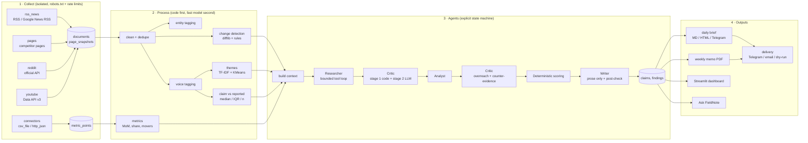
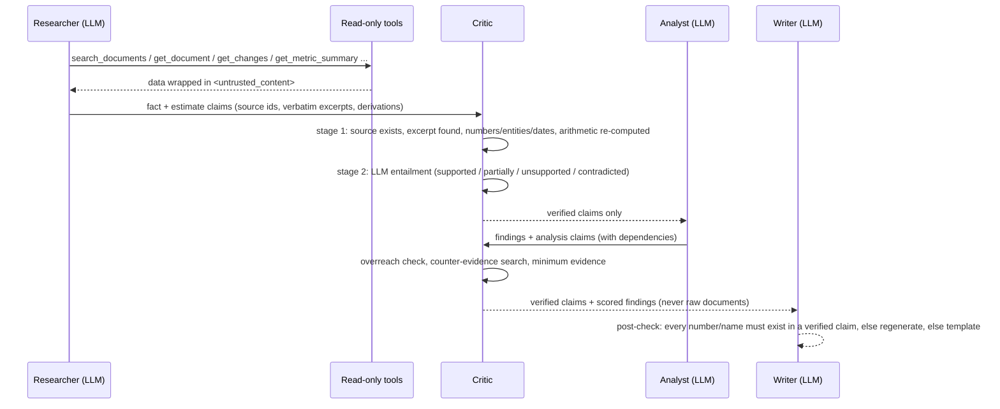
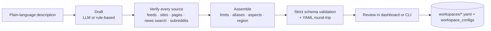

# Architecture

FieldNote is a single Python package (`src/fieldnote`) with a Typer CLI, a Streamlit dashboard and a
scheduled pipeline. Everything sector-specific lives in `workspaces/<slug>.yaml`; the code only knows
the *shape* of a workspace.

## Pipeline

## Trust model: claims and the critic

## Modules

| Layer | Modules | Notes |
|---|---|---|
| Config | `config.py` | Pydantic v2 schema for workspaces, env `Settings`, fixture overlay, path sanitising, region profiles |
| Workspaces | `workspaces.py`, `builder/*` | Registry of file + database copies (archive, restore, import); plain-language builder that drafts, verifies and assembles workspaces |
| Storage | `db/engine.py`, `db/models.py`, `db/repo.py` | SQLAlchemy 2.0; SQLite default, Postgres via `DATABASE_URL`; versioned `create_all` + additive column migration |
| LLM | `llm/base.py`, `llm/anthropic_client.py`, `llm/mock_client.py`, `llm/mock_agents.py`, `llm/cache.py`, `llm/schemas.py` | Provider-neutral interface; forced tool use for structured output; cache + cost tracker on every call |
| Collection | `collectors/*`, `collectors/connectors/*`, `collectors/fixtures.py` | One interface; polite HTTP client (robots, pacing, private-address guard); GDELT news search; connector registry; offline replay |
| Processing | `processing/*`, `heuristics.py` | Cleaning, dedupe, change detection, tagging, themes, claim vs reported, metrics |
| Agents | `agents/*` | Tools, researcher, critic, analyst, writer, orchestrator, tracer |
| Scoring | `scoring/opportunities.py` | Pure functions; re-rankable without LLM calls |
| Ask | `ask/router.py`, `ask/answer.py` | Local-only retrieval, critic-gated answers, session memory |
| Coordination | `coordination/*` | Action-item extraction, tracker, reminders, Sheets export |
| Reports | `reports/*` | Jinja2 templates, reportlab PDF, matplotlib charts |
| Delivery | `delivery/*` | Telegram, SMTP, dry-run outbox, routing |
| Evals | `evals/*` | Citation validity, adversarial critic, number consistency, extraction P/R, ranking, cost |
| Entry points | `cli.py`, `pipeline.py`, `doctor.py`, `exporter.py`, `dashboard/*` | |

## Data model

All tables carry `workspace` and timestamps: `runs`, `documents`, `page_snapshots`, `change_events`,
`metric_points`, `voice_tags`, `themes`, `claim_vs_reported`, `claims`, `findings`, `briefs`,
`meeting_notes`, `action_items`, `llm_cache`, `agent_traces`, plus `http_cache` (conditional requests),
`eval_results`, `workspace_configs` (workspace YAML shared by hosted dashboards and schedulers) and
`schema_version`.

## Workspace builder

The description is wrapped as untrusted input in the prompt. The model can only propose; code verifies
and assembles, so an unverifiable URL, a duplicated alias or an invalid aspect never reaches a saved
workspace.

## Idempotency and history

* A run is keyed by (workspace, local date, mode, kind). Re-running the same day resets that run's
  derived rows (claims, themes, changes, traces, snapshots) and rebuilds them; documents are upserted
  by URL / content hash, so nothing is duplicated.
* Findings persist across runs and are merged by fuzzy title plus entity and evidence overlap;
  `first_seen`/`last_seen` are maintained and unseen findings become `stale`.
* Offline mode replays fixture *rounds* (a baseline week, then the current week) so change detection
  and week-over-week themes have history on the very first run.

## Degradation

Every collector, processing step and agent stage is isolated. Failures are logged, recorded in
`runs.stats`, and the run continues: missing keys skip collectors, LLM failures fall back to
deterministic heuristics or templates, an exhausted budget stops LLM calls but keeps verified output,
and delivery falls back to the dry-run outbox.
